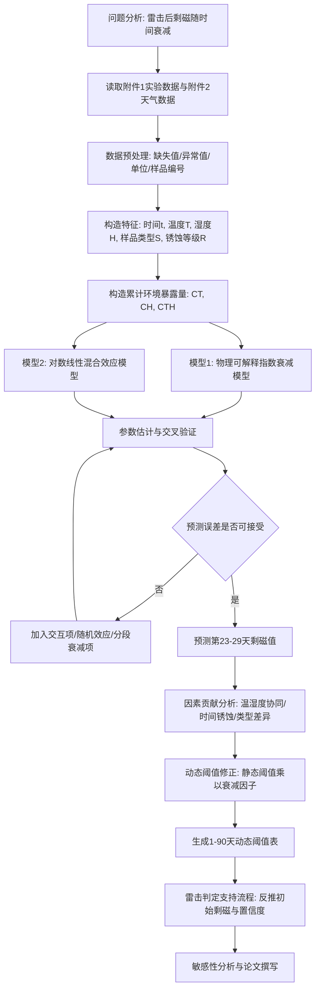
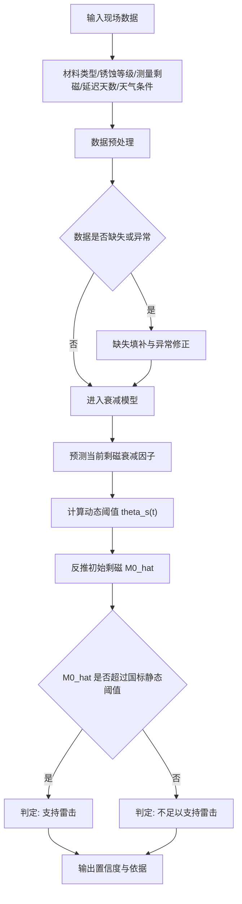

# B题 剩磁法雷击判定预测：破题与完整做题流程

## 0. 题目核心理解

本题围绕“剩磁法雷击判定”的实际应用展开。国家标准给出了静态判定阈值：

- 小尺寸铁件，如小号铁钉、小号铁夹：`1.0 mT`
- 大尺寸铁件，如普通钢筋、锈蚀钢筋：`1.5 mT`

但题目指出：雷击后的剩磁会随时间衰减，并且温度、湿度、锈蚀状态、材料形状与尺寸都会影响衰减速率。因此，本题的本质不是简单拟合曲线，而是：

> 建立具有物理解释性的剩磁衰减动力学模型，并将静态判定阈值改造为随时间、环境和材料变化的动态阈值。

附件 1 为实验数据，共 `1380` 行、`6` 列，字段包括样品类型、编号、测量天数、剩磁、温度、湿度。附件 2 为 1-90 天逐日天气数据。

---

## 1. 核心考点矩阵

| 问题模块 | 数学理论考点 | 算法实现考点 | 数据处理考点 | 难点与踩分点 |
|---|---|---|---|---|
| 问题1：剩磁衰减动态模型 | 非线性动力学、指数衰减、对数线性化、混合效应模型、时间序列回归 | 非线性最小二乘、最大似然估计、混合效应回归、交叉验证 | 将数据整理为“样品类型-编号-时间”的面板数据；提取初始剩磁；构造累计温湿度暴露量 | 不能只做普通曲线拟合，要体现剩磁衰减的物理机制和环境累计效应 |
| 问题2：关键因素贡献分析 | 方差分析、回归显著性检验、交互效应分析、可解释统计建模 | `statsmodels` 线性/混合效应模型、ANOVA、随机森林和 SHAP 辅助解释 | 温度、湿度中心化；构造 `温度×湿度`、`时间×锈蚀`、样品类型哑变量 | 评委重点看“独立贡献”和“交互效应”，不能只给相关系数 |
| 问题3：动态阈值修正 | 阈值反演、风险判定、预测区间、分位数修正 | Bootstrap、蒙特卡洛模拟、参数置信区间、动态表格生成 | 利用附件 2 的 1-90 天天气序列生成逐日衰减因子 | 阈值修正方向容易出错：延迟越久，当前可接受判雷阈值应越低 |
| 问题4：判定流程与验证 | 分类判别、概率决策、置信度评估、贝叶斯思想 | 逻辑回归、似然判别、预测区间判定、流程自动化 | 输入材料类型、测量剩磁、延迟时间、环境条件，输出判定结果和置信度 | 要设计可落地流程，而不是只停留在模型公式 |

---

## 2. 数据初步观察

附件 1 中共有四类样品：

| 样品类型 | 样品数 | 观测行数 | 初始剩磁均值 mT | 初始剩磁范围 mT | 第 90 天均值 mT |
|---|---:|---:|---:|---:|---:|
| 小号铁钉 | 20 | 460 | 2.6269 | 1.6653-3.7538 | 0.0015 |
| 小号铁夹 | 20 | 460 | 2.5214 | 1.8557-3.3540 | 0.0010 |
| 普通钢筋 | 10 | 230 | 3.4839 | 2.0255-5.4727 | 0.0084 |
| 锈蚀钢筋 | 10 | 230 | 4.1933 | 2.4120-5.5178 | 0.0006 |

关键观察：

- 所有类型剩磁均呈显著衰减趋势，且 90 天后接近 0。
- 普通钢筋相对更稳定，第 90 天均值高于其他类型。
- 锈蚀钢筋虽然初始剩磁较高，但后期衰减更快，说明“锈蚀状态”可能显著增强衰减。
- 小号铁钉、小号铁夹在第 15-30 天附近已可能低于国标静态阈值，因此动态阈值修正具有必要性。

---

## 3. 可视化做题全流程图

已绘制好的流程图文件：


对应 Mermaid 源码如下，便于后续修改：



---

## 4. Phase 1：问题重述与假设预设

### 4.1 问题重述

已知模拟雷击后四类铁磁性样品在多个时间点的剩磁测量值，以及测量期间的温湿度数据。要求：

1. 建立剩磁随时间、温度、湿度、样品类型和锈蚀等级变化的动态衰减模型。
2. 定量分析温度、湿度、锈蚀、样品类型及交互项对剩磁衰减的影响。
3. 基于衰减模型修正国家标准中的静态剩磁判定阈值。
4. 设计一套完整的雷击判定支持流程，并给出置信度评估。

### 4.2 建模假设

1. 同一铁件雷击后的真实剩磁总体单调衰减，局部波动视为测量误差。
2. 温度和湿度主要通过改变衰减速率影响剩磁，而不直接改变初始剩磁。
3. 同一类型样品具有相近的基础衰减规律，但不同编号样品存在个体随机差异。
4. 环境影响具有累计效应，因此使用逐日温湿度暴露量刻画环境作用。
5. 在对数剩磁空间中，测量误差近似服从正态分布。

---

## 5. Phase 2：符号说明与变量定义

| 符号 | 含义 |
|---|---|
| $M_{i,s}(t)$ | 类型 $s$、编号 $i$ 样品在第 $t$ 天的剩磁值 |
| $M_{i,s}(0)$ | 初始剩磁基准值 |
| $T_t$ | 第 $t$ 天温度 |
| $H_t$ | 第 $t$ 天相对湿度 |
| $R_s$ | 锈蚀等级，普通样品为 0，锈蚀钢筋为 3 |
| $S_s$ | 样品类型变量 |
| $\Lambda_s(t)$ | 从第 0 天到第 $t$ 天的累计衰减强度 |
| $\theta_s(0)$ | 国标静态阈值 |
| $\theta_s(t)$ | 第 $t$ 天动态修正阈值 |
| $\epsilon_{i,t}$ | 测量误差 |

---

## 6. Phase 3：核心模型构建

### 6.1 基础指数衰减模型

雷击后铁件剩磁通常呈非线性衰减，可建立：

$$
M_{i,s}(t)=M_{i,s}(0)\exp[-\Lambda_s(t)]+\epsilon_{i,t}
$$

其中 $\Lambda_s(t)$ 表示从雷击后到第 $t$ 天的累计衰减强度。

若环境条件不变，可退化为：

$$
M_{i,s}(t)=M_{i,s}(0)\exp(-k_s t)
$$

其中 $k_s$ 是样品类型 $s$ 的基础衰减速率。

### 6.2 加入温度、湿度和交互效应

由于温湿度逐日变化，建议定义每日衰减速率：

$$
k_s(\tau)=\exp[
\alpha_s+
\beta_T(T_\tau-\bar T)+
\beta_H(H_\tau-\bar H)+
\beta_{TH}(T_\tau-\bar T)(H_\tau-\bar H)+
\beta_RR_s+
\beta_{TR}R_s\log(1+\tau)
]
$$

累计衰减强度为：

$$
\Lambda_s(t)=\sum_{\tau=1}^{t} k_s(\tau)
$$

因此：

$$
M_{i,s}(t)=M_{i,s}(0)\exp[-\sum_{\tau=1}^{t} k_s(\tau)]+\epsilon_{i,t}
$$

该模型的优点：

- 指数形式保证剩磁预测值非负。
- 每日衰减率可由温度、湿度、锈蚀等级和样品类型解释。
- $\beta_{TH}$ 可直接检验“温度×湿度”协同效应。
- $\beta_{TR}$ 可直接检验“时间×锈蚀”累积效应。

### 6.3 对数线性混合效应模型

为了便于统计检验，可对剩磁作对数变换：

$$
y_{i,s,t}=\ln\frac{M_{i,s}(t)}{M_{i,s}(0)}
$$

建立：

$$
y_{i,s,t} =
\gamma_0+
\gamma_1t+
\gamma_2C_T(t)+
\gamma_3C_H(t)+
\gamma_4C_{TH}(t)+
\gamma_5R_s+
\gamma_6R_s\ln(1+t)+
\gamma_7S_s+
u_i+\epsilon_{i,t}
$$

其中：

$$
C_T(t)=\sum_{\tau=1}^{t}(T_\tau-\bar T)
$$

$$
C_H(t)=\sum_{\tau=1}^{t}(H_\tau-\bar H)
$$

$$
C_{TH}(t)=\sum_{\tau=1}^{t}(T_\tau-\bar T)(H_\tau-\bar H)
$$

$u_i$ 表示样品编号的随机效应，用于刻画同类型不同样品之间的个体差异。

---

## 7. Phase 4：模型求解与代码架构

### 7.1 推荐工具

建议使用 Python：

| 任务 | 推荐库 |
|---|---|
| 数据读取与清洗 | `pandas`, `openpyxl` |
| 数值优化 | `scipy.optimize` |
| 统计建模 | `statsmodels` |
| 机器学习辅助解释 | `sklearn`, `shap` |
| 可视化 | `matplotlib`, `seaborn` |
| Excel 结果输出 | `pandas.ExcelWriter`, `openpyxl` |

MATLAB 可替代方案：

| 任务 | 推荐函数 |
|---|---|
| 非线性拟合 | `fitnlm` |
| 混合效应模型 | `fitlme` |
| 方差分析 | `anova` |
| 表格读写 | `readtable`, `writetable` |

### 7.2 Python 代码架构

```python
import pandas as pd
import numpy as np
from scipy.optimize import curve_fit, minimize
import statsmodels.formula.api as smf
from sklearn.metrics import mean_absolute_error, mean_squared_error, r2_score

# 1. 读取数据
exp = pd.read_csv("data/附件1_模拟实验数据.csv")
weather = pd.read_excel("data/附件2-weather_data.xlsx")

# 2. 数据预处理
exp = exp.rename(columns={
    "样品类型": "sample_type",
    "编号": "sample_id",
    "测量天数": "day",
    "剩磁(mT)": "M",
    "温度(℃)": "T",
    "相对湿度(%)": "H"
})

# 3. 提取初始剩磁
m0 = exp[exp["day"] == 0][["sample_type", "sample_id", "M"]]
m0 = m0.rename(columns={"M": "M0"})
df = exp.merge(m0, on=["sample_type", "sample_id"])
df["log_ratio"] = np.log(df["M"] / df["M0"])

# 4. 构造特征
df["T_center"] = df["T"] - df["T"].mean()
df["H_center"] = df["H"] - df["H"].mean()
df["TH"] = df["T_center"] * df["H_center"]
df["log_day"] = np.log1p(df["day"])
df["rust"] = (df["sample_type"] == "锈蚀钢筋").astype(int) * 3
df["rust_time"] = df["rust"] * df["log_day"]

# 5. 混合效应模型
model = smf.mixedlm(
    "log_ratio ~ day + T_center + H_center + TH + rust + rust_time + C(sample_type)",
    data=df,
    groups=df["sample_id"]
)
result = model.fit()
print(result.summary())

# 6. 预测与评估
df["pred_log_ratio"] = result.predict(df)
df["pred_M"] = df["M0"] * np.exp(df["pred_log_ratio"])

mae = mean_absolute_error(df["M"], df["pred_M"])
rmse = mean_squared_error(df["M"], df["pred_M"], squared=False)
r2 = r2_score(df["M"], df["pred_M"])
print(mae, rmse, r2)

# 7. 生成第23-29天预测
# 8. 生成1-90天动态阈值表
# 9. 导出Excel
```

---

## 8. 问题1：第 23-29 天剩磁预测方案

执行步骤：

1. 对四类样品分别提取第 0 天初始剩磁均值或每个编号的初始剩磁。
2. 使用附件 2 的第 23-29 天天气数据构造温湿度特征。
3. 将第 23-29 天输入已训练模型。
4. 输出四类样品在第 23、24、25、26、27、28、29 天的剩磁预测均值。
5. 同时给出 95% 预测区间，增强可信度。

建议表格格式：

| 样品类型 | 第23天 | 第24天 | 第25天 | 第26天 | 第27天 | 第28天 | 第29天 |
|---|---:|---:|---:|---:|---:|---:|---:|
| 小号铁钉 | 预测值 | 预测值 | 预测值 | 预测值 | 预测值 | 预测值 | 预测值 |
| 小号铁夹 | 预测值 | 预测值 | 预测值 | 预测值 | 预测值 | 预测值 | 预测值 |
| 普通钢筋 | 预测值 | 预测值 | 预测值 | 预测值 | 预测值 | 预测值 | 预测值 |
| 锈蚀钢筋 | 预测值 | 预测值 | 预测值 | 预测值 | 预测值 | 预测值 | 预测值 |

---

## 9. 问题2：关键影响因素定量分析

### 9.1 温度与湿度协同效应

核心检验项：

$$
\beta_{TH}(T-\bar T)(H-\bar H)
$$

判断逻辑：

- 若 $\beta_{TH}>0$ 且 p 值小于 0.05，说明高温高湿存在耦合加速衰减现象。
- 若 $\beta_{TH}$ 不显著，说明温湿度更多表现为独立叠加影响。

建议图表：

- 温度-湿度二维响应面图
- 不同湿度水平下温度对衰减速率的边际影响曲线

### 9.2 时间与锈蚀累积效应

核心检验项：

$$
\beta_{TR}R_s\ln(1+t)
$$

判断逻辑：

- 若 $\beta_{TR}>0$ 且显著，说明锈蚀随时间推移显著增强衰减。
- 可比较普通钢筋与锈蚀钢筋的衰减曲线斜率。

建议图表：

- 普通钢筋与锈蚀钢筋平均剩磁衰减曲线
- 两类钢筋的剩磁比值随时间变化曲线

### 9.3 样品类型响应差异

重点比较：

- 小号铁钉 vs 小号铁夹：尺寸相近但形状不同。
- 普通钢筋 vs 锈蚀钢筋：尺寸相同但锈蚀等级不同。
- 小尺寸铁件 vs 大尺寸铁件：尺寸差异对剩磁稳定性的影响。

建议报告指标：

- 半衰期 $t_{1/2}$
- 30 天剩磁保留率
- 90 天剩磁保留率
- 衰减速率参数 $k_s$

---

## 10. 问题3：动态阈值修正模型

国标静态阈值为：

$$
\theta_s(0)=
\begin{cases}
1.0, & s\in\{\mathrm{nail},\mathrm{clip}\}\\
1.5, & s\in\{\mathrm{bar},\mathrm{rusty\ bar}\}
\end{cases}
$$

其中 `nail` 表示小号铁钉，`clip` 表示小号铁夹，`bar` 表示普通钢筋，`rusty bar` 表示锈蚀钢筋。

若雷击后第 $t$ 天才检测，则当前剩磁阈值应修正为：

$$
\theta_s(t)=\theta_s(0)\exp[-\widehat{\Lambda}_s(t)]
$$

判定方式有两种等价表达。

### 10.1 动态阈值直接判定

若实际测量值：

$$
M_{\text{obs}}\geq \theta_s(t)
$$

则支持“曾发生雷击”的判定。

### 10.2 反推初始剩磁判定

将当前剩磁反推回雷击初始时刻：

$$
\widehat{M}_0=M_{\mathrm{obs}}\exp[\widehat{\Lambda}_s(t)]
$$

若：

$$
\widehat{M}_0\geq \theta_s(0)
$$

则支持“曾发生雷击”的判定。

建议最终输出 Excel 表格：

| 天数 | 小号铁钉动态阈值 | 小号铁夹动态阈值 | 普通钢筋动态阈值 | 锈蚀钢筋动态阈值 |
|---:|---:|---:|---:|---:|
| 1 | 计算值 | 计算值 | 计算值 | 计算值 |
| 2 | 计算值 | 计算值 | 计算值 | 计算值 |
| ... | ... | ... | ... | ... |
| 90 | 计算值 | 计算值 | 计算值 | 计算值 |

---

## 11. 问题4：雷击判定支持流程

已绘制好的流程图文件：


对应 Mermaid 源码如下，便于后续修改：



置信度可定义为：

$$
P=\Pr(\widehat{M}_0 \geq \theta_s(0))
$$

实际计算时可通过 Bootstrap 或预测误差分布估计：

1. 重采样训练数据，重复拟合模型。
2. 每次计算 $\widehat{M}_0^{(b)}$。
3. 统计满足 $\widehat{M}_0^{(b)} \geq \theta_s(0)$ 的比例。
4. 该比例即为雷击判定置信度。

---

## 12. 结果检验与敏感性分析

必须完成以下检验：

| 检验类型 | 目的 | 推荐指标或方法 |
|---|---|---|
| 预测精度检验 | 验证模型拟合和外推能力 | MAE、RMSE、MAPE、$R^2$ |
| 交叉验证 | 防止过拟合 | 按样品编号留一法、按时间点留出法 |
| 残差诊断 | 检查模型系统偏差 | 残差-拟合值图、QQ 图 |
| 显著性检验 | 支撑因素贡献结论 | p 值、置信区间、ANOVA |
| 敏感性分析 | 验证动态阈值稳定性 | 温度 ±2℃、湿度 ±5%、锈蚀等级变化 |
| 不确定性分析 | 给出判定可信度 | Bootstrap 95% 预测区间 |

---

## 13. 论文写作建议结构

建议论文按照以下逻辑展开：

1. 摘要
   - 说明建立了考虑时间、温湿度、样品类型和锈蚀状态的动态衰减模型。
   - 给出关键发现：高温高湿是否加速衰减、锈蚀是否增强长期衰减。
   - 说明已生成 1-90 天动态阈值表和雷击判定流程。

2. 问题重述
   - 强调静态阈值在延迟检测场景下存在误判风险。

3. 数据预处理
   - 描述附件 1、附件 2 字段。
   - 给出缺失值、异常值、初始剩磁范围和样品分布。

4. 模型假设与符号说明
   - 使用本文件第 4、5 节。

5. 问题1模型建立与预测
   - 指数衰减模型。
   - 环境累计暴露量。
   - 第 23-29 天预测表。

6. 问题2因素分析
   - 温湿度协同效应。
   - 时间与锈蚀累积效应。
   - 样品类型差异。

7. 问题3动态阈值修正
   - 给出动态阈值公式。
   - 生成 1-90 天修正表。

8. 问题4判定流程与验证
   - 给出流程图。
   - 给出概率/置信度计算方法。

9. 模型评价
   - 优点：物理解释强、可落地、可扩展。
   - 不足：实验环境有限、长期外推存在不确定性。
   - 改进：引入更多气象变量、更多材料样本、真实雷击案例验证。

---

## 14. 最推荐的主线表达

本题最稳的论文主线是：

> 剩磁衰减动力学模型 → 温湿度与锈蚀交互解释 → 静态阈值动态化 → 可执行雷击判定流程。

这样写能同时满足：

- 数学建模深度
- 物理可解释性
- 统计显著性
- 工程应用价值
